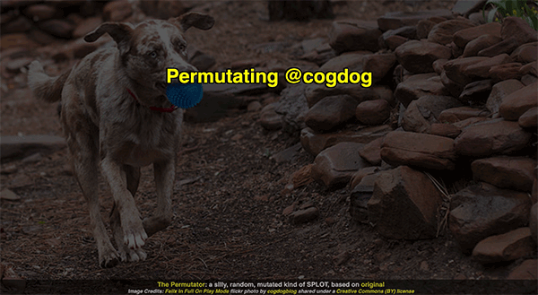
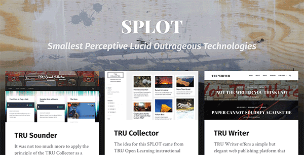

# The Permuator
by Alan Levine https://cog.dog/

-----
*If this kind of stuff has any value to you, please consider supporting me so I can do more!*

 

----- 

## What is This?

See https://cogdog.github.io/permutator for a "stunning" demo where you can see maybe what "COGDOG" stands for?

This is github based SPLOT for randomizing the possible words to make up nebulous acronyms like SPLOT first done in a hard coded way at https://splot.ca -- GIF version here

Ah, but now we have a new twist. Rather than having the word choices being hard coded in a file, they are defined by json files in the `/wordsrc` directory on this site.

Try this reproduction of the original SPLOT mix

https://cogdog.github.io/permutator/?wordsrc=splot

and a favorite pal

https://cogdog.github.io/permutator/?wordsrc=felix

## Specifications for JSON Format

*this is rough now, needs refinement for sure!*

The URl parameter for `wordsrc=` specifies the name of a json data file in the `wordsrc/` directory so a file named `felix.json` is requested by the URL https://cogdog.github.io/permutator/?wordsrc=felix

To create your own permutator, you could download this repo and run from your own server. Then, make versions of the data files in the `/wordsrc` directory. OR... and even more fun, just add your own files to this repo.

Download a copy of an existing data file, modify to fit your own permutating message, and submit as a pull request. The json data fields are:

`title`: The main title that appears in yellow
`background`: The background image; either local if uploaded to the `images` director or a full URL to source image
`attribution`: credit for image, added to the footer
`allwords`: an array of arrays for the word choices (see an example)

Ultimately, if I were a decent coder, I should build a tool that generates some json...

